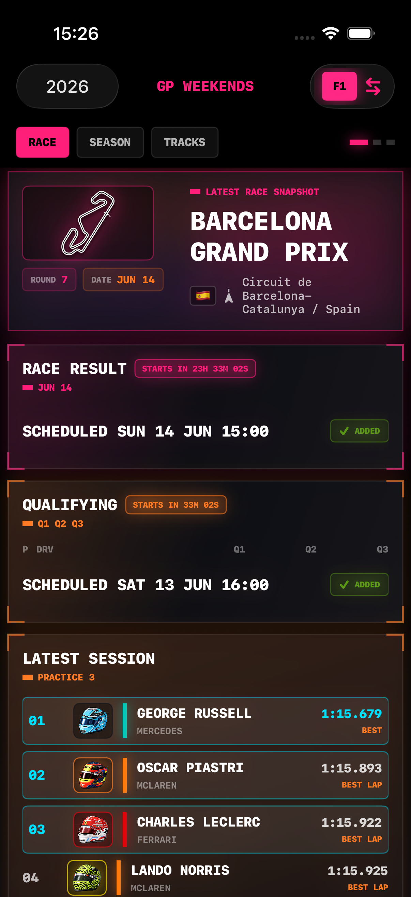
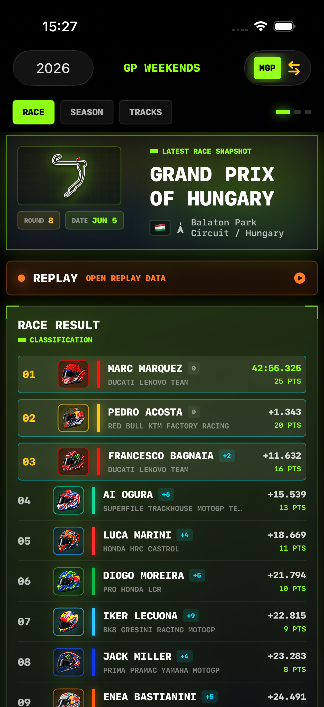
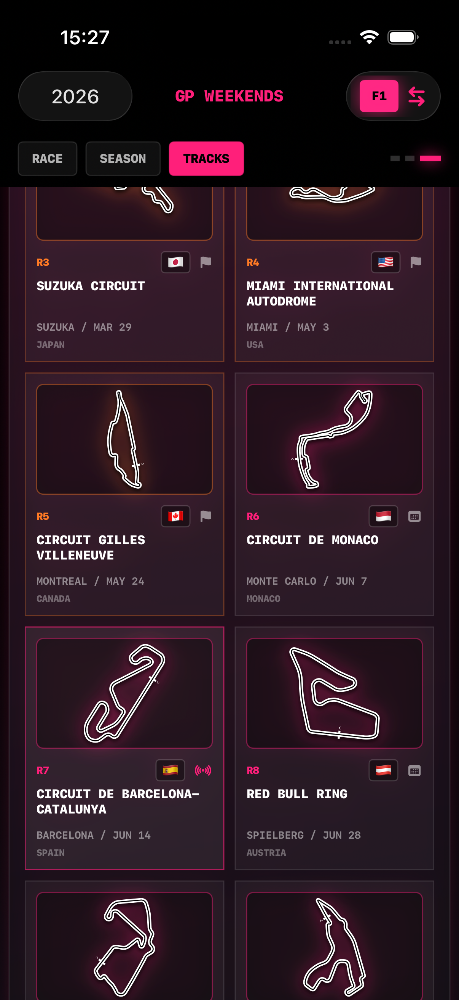
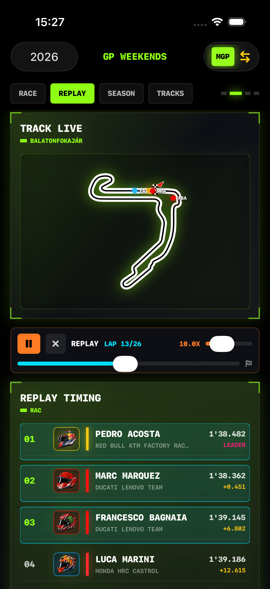
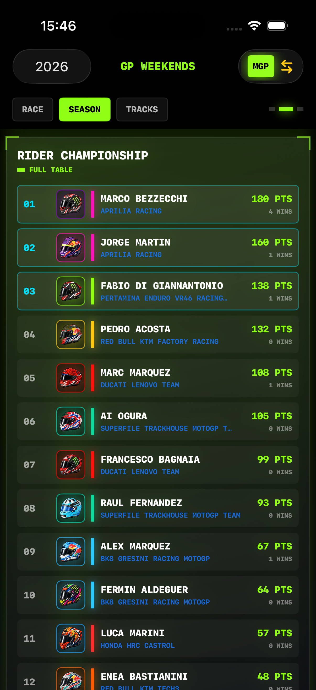
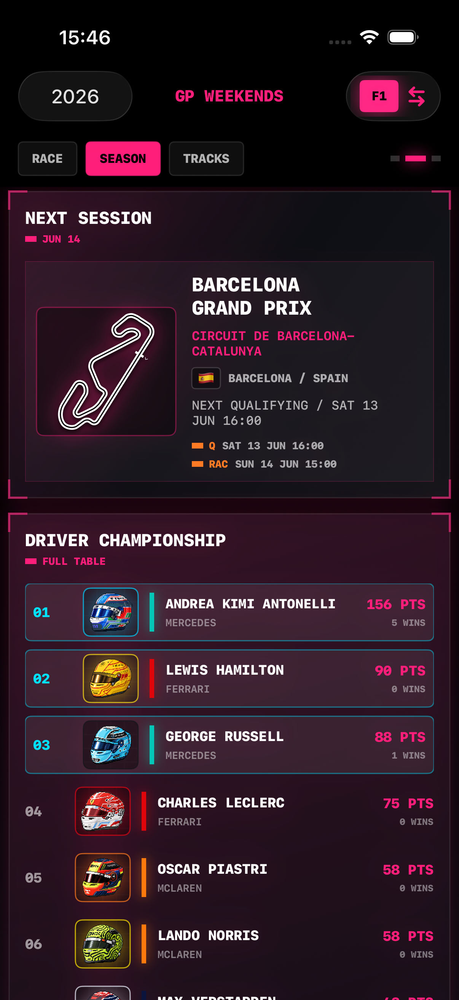
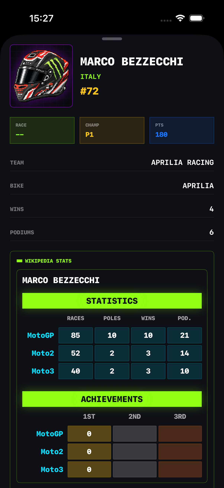

# GP Weekends

Welcome to the official documentation for **GP Weekends**, the ultimate unofficial companion application for Formula 1® and MotoGP™ enthusiasts.

Designed with a visually striking, retro-futuristic **neon pixel-art aesthetic**, GP Weekends brings the excitement of the track right to your screen. Whether you want to track live laptimes, analyze race results, check championship standings, or simulate historic races, GP Weekends has you covered.

---

## 🏎️ Key Features

### 1. Dual-Series Hub (F1 & MotoGP)

Easily toggle between **Formula One** and **MotoGP** championships in a unified dashboard. No more switching between multiple disjointed apps—get full access to both worlds in a single, coherent user experience.

  

    
    
F1 Live Dashboard

  

  

    
    
MotoGP Live Dashboard

  

---

### 2. Live Timing & Interactive Replay

*   **Live Timing Tower**: Get real-time updates and timing gaps during active race weekends.
*   **Interactive Replays**: Replay archived sessions with an in-app telemetry player, showing active driver positioning markers mapped onto detailed circuit routes, sector progress, and tyre strategy selections.

!!! warning "No F1 Live Telemetry"
    Please note that **real-time F1 Live Timing is not authorized or provided by OpenF1** for unofficial applications. Consequently, live telemetry feeds are restricted to MotoGP sessions, while F1 timing data remains limited to session replays and post-session historical results.

  

    
    
F1 Live Timing Tower

  

  

    
    
F1 Interactive Telemetry Replay

  

  

    
    
MotoGP Live Replay Grid

  

---

### 3. Comprehensive Standings & Rider Palmares

Track the battle for the crown with complete and auto-updating leaderboard standings (F1 Driver/Constructor, MotoGP Rider/Team). Check active rider biographies, historical statistic tables, and detailed palmares scraped directly from Wikipedia on the fly.

  

    
    
F1 Championship Standings

  

  

    
    
MotoGP Championship Standings

  

  

    
    
Rider Biography & Historical Palmares

  

---

## ⚡ Neon Design System & Pixel Art

GP Weekends is uniquely characterized by its custom **Neon Pixel-Art Design System**. This includes:
*   **Procedural Renderers**: High-performance SwiftUI rendering engines that draw customized helmets, single-seaters, and superbikes dynamically.
*   **Custom Dark Theme**: A high-contrast palette mixing cyber pink, electric cyan, and lime green accents over a deep space-black grid background.

---

## 🛠️ Software Architecture

Following a recent comprehensive refactoring, GP Weekends is built upon a highly modular, decoupled **Clean Architecture** structure:

*   📂 `/Domain/Models/`: Core entity data models and thread-safe caches (e.g., `F1Race`, `MotoGPRaceResultRow`).
*   📂 `/Data/Services/`: Independent network clients (Jolpica, OpenF1, MotoGP, Wikipedia) decoupled from state management via protocol boundaries.
*   📂 `/Presentation/`: Layered view models/stores separating business workflows from the rendering layers.
*   📂 `/Components/Common/`: Reusable UI buttons, asset engines, and procedural pixel art designs.
